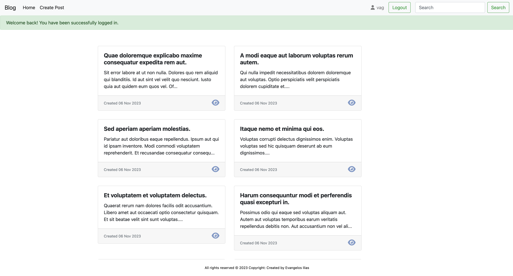
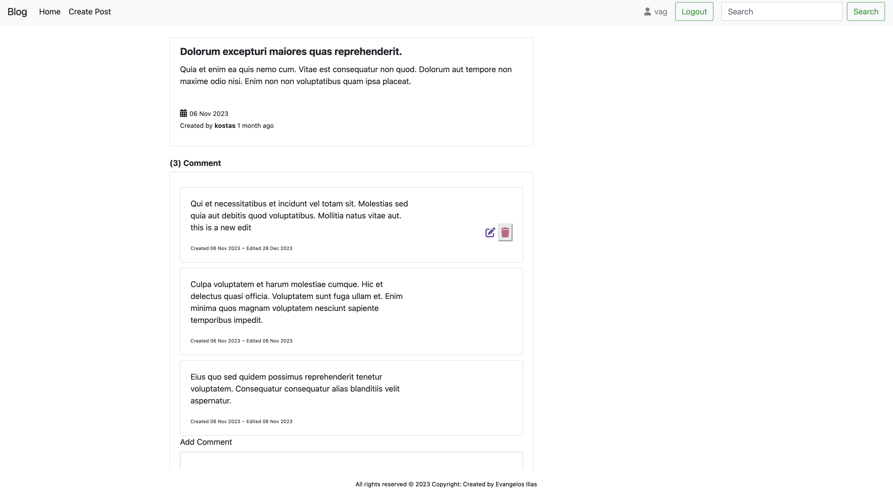

# Blog Test Project
## Overview

The Blog Test Project is a Laravel-based web application designed for users to manage blog posts and comments. The project utilizes the Laravel framework, providing features such as user registration, login, post creation, editing, and deletion. Users can also comment on posts, with the added functionality to edit and delete their own comments. The search box enables users to find content based on titles, posts, or comments.
Prerequisites

Before you get started, make sure you have the following installed:
    
  - Valet (for macOS users)
  - For macOS users with Valet:
    
        http://blog.test

Installation

    git clone https://github.com/your-username/blog-test-project.git

Navigate to the project directory

  - cd blog-test-project

Run database migrations

    php artisan migrate

Seed the database with sample data:

    php artisan migrate --seed

Testing

    php artisan test

## Example Images

## Customization

  - Feel free to download the project and make any amendments based on your requirements.

## License

  - This project is licensed under the [MIT License](LICENSE).
